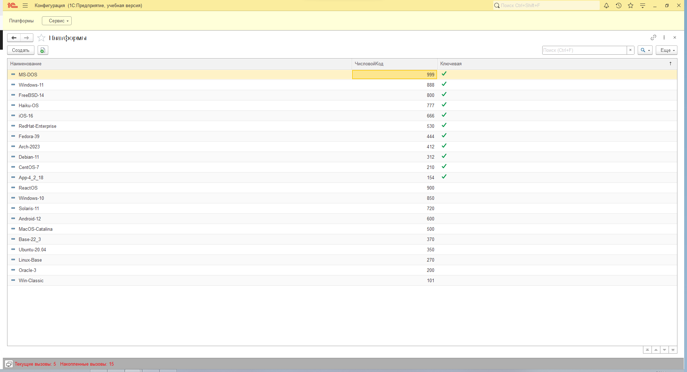
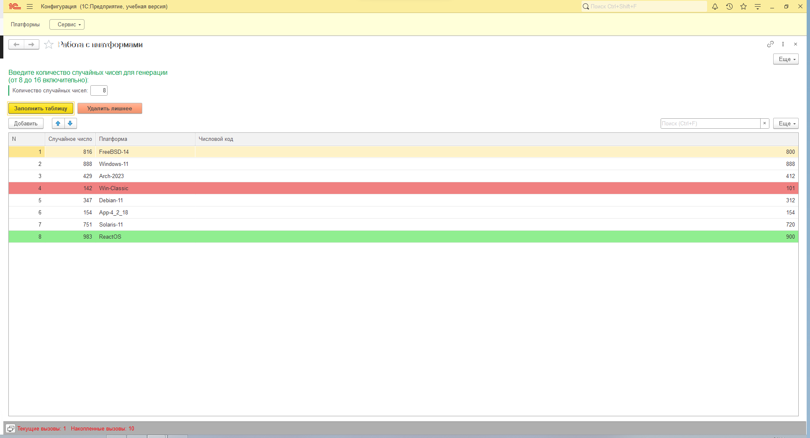
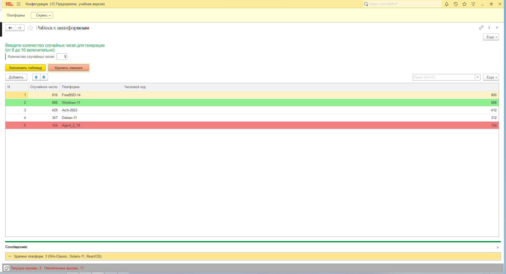

# Платформы (внешняя обработка)

## Описание задачи

Внешняя обработка для платформы 1С:Предприятие 8.3 (управляемые формы), демонстрирующая навыки работы с клиент-серверной архитектурой и справочниками. Проект выполнен в рамках технического задания для позиции 1С-программиста.

### Исходные данные

* Архитектура: клиент-сервер
* Платформа: 1С:Предприятие 8.3.26
* Используемый объект: справочник **Платформы** со следующими реквизитами:

  * `Наименование` (строка, 50 символов)
  * `ЧисловойКод` (число, от 100 до 999; уникальное значение)
  * `Ключевая` (булево)

## Описание функционала

### Команда "Заполнить таблицу"

* Пользователь вводит число от 8 до 16 — количество генерируемых случайных чисел в диапазоне от 100 до 999.
* Для каждого случайного числа выполняется поиск платформы, чей числовой код **максимально близок, но не превышает** это число.
* Результаты отображаются в таблице на форме: сгенерированное число, найденная платформа и её числовой код.
* Строка с **минимальным кодом** платформы подсвечивается красным, с **максимальным** — зелёным.

### Команда "Удалить лишнее"

* Из таблицы удаляются все строки, где признак `Ключевая` равен `Ложь`.
* После удаления пользователю выводится сообщение в формате:

```
Удалено платформ: 3 (App-4_2_18, Base-22_3, Oracle-3)
```

* Удалённые платформы сортируются по возрастанию числового кода.

## Структура репозитория

```
/1С-Projects/
  /Платформы/
    /Скриншоты/          — визуальные иллюстрации и интерфейс
    README.md            — описание проекта
    Платформы.dt         — выгрузка информационной базы
    
```

## Скриншоты



**Рисунок 1. Исходная форма справочника «Платформы»**



**Рисунок 2. Команда «Заполнить таблицу»**



**Рисунок 3. Команда «Удалить лишнее»**

## Как использовать

1. Создайте новую пустую информационную базу и откройте её в Конфигураторе 1С.
2. Через меню **Администрирование → Загрузить информационную базу из файла** загрузите файл `Платформы.dt`.
3. Введите число от 8 до 16 и нажмите **"Заполнить таблицу"**.
4. Для удаления строк с неключевыми платформами нажмите **"Удалить лишнее"**.

## Цель проекта

* Реализовать алгоритм генерации и подбора платформ на стороне сервера с минимальным числом запросов к СУБД.
* Обеспечить удобный пользовательский интерфейс: вывод результатов в табличную часть и подсветку крайних значений.
* Соблюдать клиент-серверную модель выполнения кода;
* Добавить валидацию и обработку ошибок: проверка диапазона ввода и корректное поведение при отсутствии подходящих записей.


